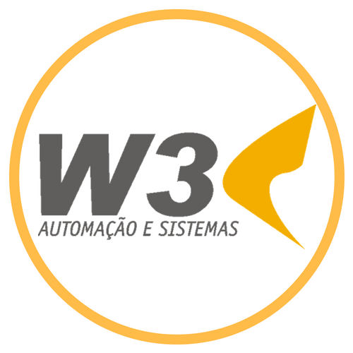

## Bem vindo a W3 Automação e Sistemas

Nossa empresa é especializada no desenvolvimento de Soluções de TI, e utiliza as arquiteturas de software mais modernas aplicadas no mercado atual de informática.

### Quem somos

Fundada em maio de 2005 por profissionais com larga experiência na área de Tecnologia da Informação, a W3 Automação e Sistemas, tornou-se uma empresa fornecedora de soluções para automação comercial e bancária, dedicada ao desenvolvimento de sistemas e soluções empresariais.

### Serviços
- **Consultoria**
  - Projetos técnicos e consultoria especializada na aplicação da tecnologia da informação aos negócios. Atualização tecnológica, contratação de serviços e sistemas de gestão, elaboração de projetos de software, gerenciamento de projetos.
- **Desenvolvimento**
  - Contamos com equipes de desenvolvimento lideradas por profissionais em constante aperfeiçoamento técnico nas ferramentas e sistemas operacionais compatíveis com nossos produtos.
- **Desenvolvimento de sistemas personalizados**
  - Sistemas Web 
  - E-business 
  - Integração com web services 
  - Conversão de sistemas
- **Implantação e Treinamento de Sistemas**
  - Tutoriais , Help On-Line e um Método de Ensino Dirigido, ministrado por instrutores com larga experiência em Automação, garantem o perfeito entendimento das funcionalidades e rotinas e sua perfeita integração ao dia a dia de empresas comerciais de segmentos mais distintos.
- **Soluções**
  - Nossos produtos abrangem as empresas em geral que possuam interesse em automatizar seus processos de informática.
- **Hospedagem**
  - Planos de hospedagem de sites, com segurança e velocidade, em servidores Linux e Windows.
- **Manutenção**
  - Instalação e configuração de redes, computadores, impressoras, programas diversos e sistemas operacionais.

### Time

Conheça nosso time.